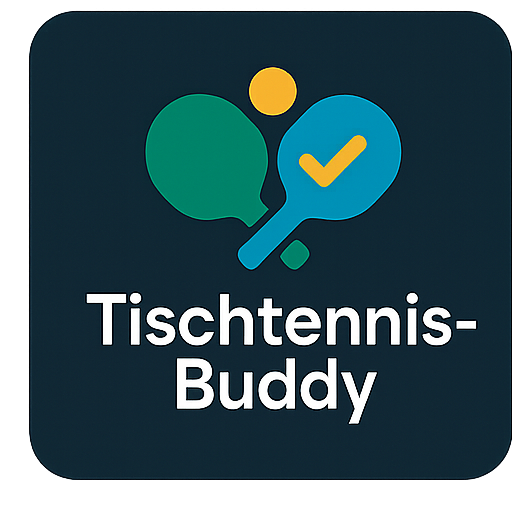

<div align="center">
  
  
  # TT Vereinsverwaltungs-Tool
  
  **Eine moderne Web-Anwendung zur Verwaltung von Tischtennis-Vereinen**
  
  [](https://opensource.org/licenses/MIT)
  [](https://www.typescriptlang.org/)
  [](https://reactjs.org/)
  [](https://supabase.com/)
  
  [Demo](https://lovable.dev/projects/9eed1551-0ce1-4955-afa1-915c1d02670c) • [Dokumentation](https://docs.lovable.dev/)
</div>

---

## 📋 Über das Projekt

Das TT Vereinsverwaltungs-Tool ist eine umfassende Web-Anwendung zur Verwaltung von Tischtennis-Vereinen. Es wurde entwickelt, um Vereinsmanagern, Vorständen und Mannschaftsführern die tägliche Arbeit zu erleichtern.

### ✨ Hauptfunktionen

- 🏓 **Mannschaftsverwaltung** - Übersichtliche Verwaltung aller Teams und Spieler
- 📅 **Spielplan-Management** - ICS-Import für automatisierte Spielpläne
- 💬 **Kommunikationstools** - Effektive Kommunikation innerhalb des Vereins
- 📧 **E-Mail-Verteilerlisten** - Professionelle E-Mail-Verwaltung für Vorstand und Admins
- 👥 **Vorstandsbereich** - Dedizierter Bereich für wichtige Mitteilungen
- 🔐 **Benutzerverwaltung** - Rollenbasiertes Zugriffssystem
- 📊 **QttrOS-Integration** - Spielerstatistiken und Rankings
- 🔄 **Vertretungsanfragen** - Organisierte Spielervertretungen
- 🎓 **Trainingsverwaltung** - Planung und Übersicht der Trainingszeiten
- 🎨 **Moderne UI** - Sauberes, randloses Design für optimale Benutzererfahrung

## 🎯 Zielgruppe

- Vereinsvorstände
- Mannschaftsführer
- Vereinsmitglieder
- Trainer und Betreuer
- Aktive Spieler

## 🚀 Quick Start

### Voraussetzungen

- Node.js (v18 oder höher) - [Installation mit nvm](https://github.com/nvm-sh/nvm#installing-and-updating)
- npm oder yarn
- Supabase Account (für Backend-Funktionen)

### Installation

```bash
# Repository klonen
git clone <YOUR_GIT_URL>

# In Projektverzeichnis wechseln
cd <YOUR_PROJECT_NAME>

# Dependencies installieren
npm install

# Entwicklungsserver starten
npm run dev
```

Die Anwendung ist dann unter `http://localhost:5173` erreichbar.

### Umgebungsvariablen

Erstelle eine `.env` Datei im Root-Verzeichnis:

```env
VITE_SUPABASE_URL=your_supabase_url
VITE_SUPABASE_ANON_KEY=your_supabase_anon_key
```

## 🛠️ Technologie-Stack

### Frontend
- **React 18.3** - UI Framework
- **TypeScript** - Type-safe JavaScript
- **Vite** - Build Tool & Dev Server
- **Tailwind CSS** - Utility-first CSS Framework
- **shadcn/ui** - Hochwertige UI-Komponenten
- **React Router** - Client-side Routing
- **TanStack Query** - Data Fetching & State Management

### Backend
- **Supabase** - Backend as a Service
  - PostgreSQL Datenbank
  - Row Level Security (RLS)
  - Authentication & Authorization
  - Edge Functions
  - Real-time Subscriptions

### Entwicklungstools
- **ESLint** - Code Linting
- **PostCSS** - CSS Processing
- **React Hook Form** - Formular-Management
- **Zod** - Schema Validation

## 📦 Verfügbare Scripts

```bash
# Entwicklungsserver starten
npm run dev

# Production Build erstellen
npm run build

# Production Build lokal testen
npm run preview

# Code Linting
npm run lint
```

## 🔒 Sicherheit

Das Projekt implementiert mehrere Sicherheitsebenen:

- Row Level Security (RLS) auf Datenbankebene
- Rollenbasierte Zugriffskontrolle (RBAC)
- Sichere Authentifizierung über Supabase
- Validierung aller Eingaben mit Zod
- HTTPS-verschlüsselte Verbindungen

## 🎨 Features im Detail

### Mannschaftsverwaltung
- Übersicht aller Teams und Mannschaften
- Spielerzuordnung und Statistiken
- Ligaverwaltung und Spielklassen

### Spielplan-Management
- Automatischer Import von .ics Dateien
- Übersichtliche Darstellung aller Spiele
- Vertretungsanfragen und -verwaltung

### Kommunikation
- Vereinsinterne Mitteilungen
- Team-spezifische Nachrichten
- Vorstandsbereich für offizielle Ankündigungen
- E-Mail-Verteilerlisten für gezielte Kommunikation
- Verwaltung von Empfängergruppen (nur Admin/Vorstand)

### Administration
- Benutzerverwaltung mit Rollen
- Import von Mitgliederdaten
- QttrOS-Integration
- Design-Einstellungen

### Benutzeroberfläche
- **Sauberes Design**: Randlose, moderne Benutzeroberfläche
- **Vollbreite-Layout**: Optimale Nutzung des verfügbaren Platzes
- **Responsive Design**: Perfekte Darstellung auf allen Geräten
- **Intuitive Navigation**: Benutzerfreundliche Bedienung

## 📝 Entwicklung

### Mit Lovable bearbeiten

Besuche das [Lovable Project](https://lovable.dev/projects/9eed1551-0ce1-4955-afa1-915c1d02670c) und starte mit Prompts.

Änderungen über Lovable werden automatisch committed.

### Mit eigener IDE

Klone das Repository, bearbeite lokal und pushe Änderungen. Diese werden auch in Lovable reflektiert.

### GitHub Codespaces

1. Klicke auf den "Code" Button
2. Wähle "Codespaces" Tab
3. Starte einen neuen Codespace
4. Bearbeite Dateien direkt im Browser

## 🚀 Deployment

### Via Lovable
Öffne [Lovable](https://lovable.dev/projects/9eed1551-0ce1-4955-afa1-915c1d02670c) und klicke auf **Share → Publish**.

### Custom Domain
Navigiere zu **Project > Settings > Domains** und klicke auf **Connect Domain**.

Mehr Informationen: [Custom Domain Setup](https://docs.lovable.dev/features/custom-domain)

### Selbst-Hosting
Die Anwendung kann auf jedem Static-Hosting-Provider deployed werden:
- Vercel
- Netlify
- Cloudflare Pages
- GitHub Pages

## 🤝 Beitragen

Dieses Projekt ist Open Source und lebt von der Community!

1. Fork das Repository
2. Erstelle einen Feature Branch (`git checkout -b feature/AmazingFeature`)
3. Committe deine Änderungen (`git commit -m 'Add some AmazingFeature'`)
4. Pushe zum Branch (`git push origin feature/AmazingFeature`)
5. Öffne einen Pull Request

## 📄 Lizenz

Dieses Projekt steht unter einer freien Open Source Lizenz. Details findest du in der [LICENSE](LICENSE) Datei.

## 👨‍💻 Autor

**Markus Dickscheit**

Entwickelt mit ❤️ für die Tischtennis-Community

## 🙏 Danksagungen

- [Lovable](https://lovable.dev) - Für die AI-powered Entwicklungsplattform
- [Supabase](https://supabase.com) - Für die Backend-Infrastruktur
- [shadcn/ui](https://ui.shadcn.com/) - Für die UI-Komponenten
- Die gesamte Tischtennis-Community für Feedback und Inspiration

## 📞 Support & Kontakt

Bei Fragen, Problemen oder Anregungen:

- 📧 Erstelle ein [Issue](../../issues)
- 💬 Diskutiere im [Lovable Discord](https://discord.com/channels/1119885301872070706/1280461670979993613)
- 📖 Lies die [Dokumentation](https://docs.lovable.dev/)

---

<div align="center">
  <strong>Gebaut mit modernen Web-Technologien</strong>
  
  React • TypeScript • Supabase • Tailwind CSS • Vite
  
  **[⭐ Star dieses Projekt](../../stargazers) wenn es dir gefällt!**
</div>
